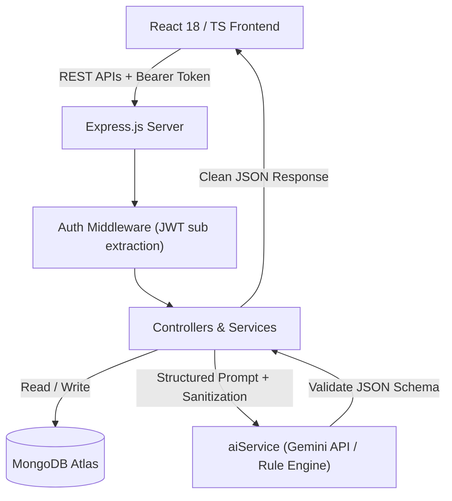

# HireLog — AI-Assisted Job Search Operating System

HireLog is an industry-ready, production-grade **AI-Assisted Job Search Operating System** built with the **MERN Stack** (MongoDB, Express.js, React, Node.js), TypeScript, Tailwind CSS, and Google Gemini API integration.

It transforms traditional job tracking into an intelligent, data-driven career application platform that answers three critical questions for applicants:
1. **Should I apply?** (Job description parsing, candidate match scoring, and skill gap identification)
2. **How should I apply?** (Grounded resume tailoring suggestions, tailored cover letters, and recruiter outreach messages)
3. **How can I improve my chances?** (Contextual interview preparation, mock interview practice mode with scoring, and conversion funnel analytics)

---

## 🌟 Key Features

### 1. Job Search Dashboard & Real Analytics
- Real-time pipeline metrics (Applications, Interviews, Offers, Rejections, Response Rates).
- Application funnel conversion tracking (`Saved` → `Applied` → `Screening` → `Interview` → `Offer`).
- Production-safe **CSV Export** with escaping and privacy safeguards.

### 2. 5-Stage Kanban Application Pipeline
- Interactive stages: **Saved**, **Applied**, **Screening**, **Interview**, **Offer**, **Closed/Rejected**.
- Optimistic drag-and-drop state updates with automatic network rollback on failure.
- Alternative keyboard-accessible pipeline status dropdown per card.

### 3. Application Detail Workspace
- Dedicated workspace per job application.
- Complete **Activity History Timeline** tracking events (Created, Resume Submitted, Recruiter Contacted, Interview Scheduled).
- Embedded AI tools for single-click resume tailoring, cover letter generation, and recruiter outreach scripts.

### 4. AI Job Intelligence Suite
- **Job Description Analyzer**: Structured extraction of required skills, preferred skills, experience, and responsibilities.
- **Match Score Evaluator**: Calculates ATS match alignment without hallucinated numbers.
- **Skill Gap Analysis**: Separates required vs. preferred skill gaps with actionable learning recommendations.

### 5. Contextual AI Application Assistant
- **Grounded Resume Tailoring**: Phrasing improvements based strictly on user-provided experience (no fabricated metrics or false achievements).
- **Tailored Cover Letters**: Role-specific 3-paragraph letters highlighting concrete technical alignment.
- **Recruiter Outreach Scripts**: Ready-to-edit LinkedIn notes, recruiter emails, and referral requests.

### 6. Interview Preparation & AI Mock Interview Mode
- Role-specific questions across **Technical**, **Behavioral**, and **System Design** categories.
- **AI Mock Interview Mode**: Evaluate practice answers on clarity, technical depth, structure, and correctness with instant score feedback (0–100).

### 7. Resume & Smart Reminder Workspaces
- Resume versioning and primary resume selection.
- Smart follow-up reminders with status management (`pending`, `completed`, `snoozed`).

---

## 🛠️ Technology Stack & Architecture

- **Frontend**: React 18, TypeScript, Tailwind CSS, Lucide React, Recharts, React Router v6
- **Backend**: Node.js, Express.js (ES Modules), Mongoose, JWT Authentication, Helmet, CORS, Rate Limiting
- **Database**: MongoDB Atlas with compound database indexing
- **AI Integration**: Google Gemini API REST client with structured JSON response schemas, token caps, and prompt injection shielding
- **Testing**: Jest with ESM support (`--experimental-vm-modules`)
- **CI/CD**: GitHub Actions workflow

---

## 📐 System Architecture Diagram



---

## 🔐 Security & Multi-User Isolation

- **Mandatory User Isolation**: All query filters enforce `userId: req.user.sub` to prevent IDOR (Insecure Direct Object Reference) vulnerabilities.
- **Prompt Injection Defense**: All user-supplied job descriptions and text are sanitized before LLM transmission.
- **Backend AI Secret Management**: API keys remain 100% server-side; endpoints are guarded by strict rate limiting (`aiLimiter`).

---

## 🚀 Getting Started locally

### Prerequisites
- Node.js (v18+)
- MongoDB connection string (local or MongoDB Atlas)

### 1. Clone & Install Dependencies

```bash
# Backend
cd job-tracker-backend
npm install

# Frontend
cd ../job-tracker-frontend
npm install
```

### 2. Environment Configuration

Create `.env` inside `job-tracker-backend/`:

```env
NODE_ENV=development
PORT=5001
MONGODB_URI=your_mongodb_connection_string
JWT_SECRET=your_jwt_secret_key
JWT_EXPIRES_IN=7d
FRONTEND_URL=http://localhost:5173
GEMINI_API_KEY=your_optional_gemini_api_key
```

Create `.env` inside `job-tracker-frontend/`:

```env
VITE_APP_NAME=HireLog
VITE_API_BASE_URL=http://localhost:5001/api
```

### 3. Run Development Servers

```bash
# Start Backend (Terminal 1)
cd job-tracker-backend
npm run dev

# Start Frontend (Terminal 2)
cd job-tracker-frontend
npm run dev
```

---

## 🧪 Testing & Verification

Run automated backend unit & security tests:

```bash
cd job-tracker-backend
npm test
```

Run frontend production build verification:

```bash
cd job-tracker-frontend
npm run build
```

---

## 📄 License

MIT License. Designed and built as an industry-ready portfolio product.
